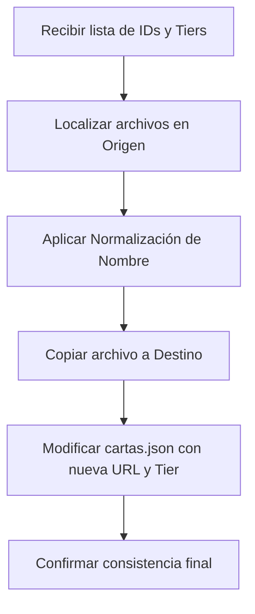

# Guía de Migración, Normalización e Integración de Cartas

Esta guía documenta el estándar de trabajo y los pasos exactos para la migración de activos de imagen, normalización de archivos e integración de metadatos (como tiers y rutas de imágenes) en el archivo central de la base de datos `cartas.json`.

---

## 1. Flujo de Trabajo Principal

Cuando se solicita procesar un grupo de cartas para integrarlas al sistema o a la tienda (Store), el procedimiento se compone de tres fases: **Localización**, **Migración/Normalización física**, y **Actualización de Metadatos**.



---

## 2. Destino de las Imágenes y Rutas

Dependiendo del tipo de carta o la solicitud, las imágenes deben guardarse en una carpeta específica del repositorio local:

| Tipo / Ubicación del Grupo | Ruta Carpeta Destino Local | Formato de URL en `cartas.json` |
| :--- | :--- | :--- |
| **Cartas de la Tienda (Store)** | `/Users/dmarambio/cartas/img/store/cartas/` | `/img/store/cartas/nombre_normalizado.webp` |
| **La Ira del Nahual / Primera Era** | `/Users/dmarambio/cartas/img/primera_era/` | `/img/primera_era/nombre_normalizado.webp` |
| **Nuevas Cartas Especiales (ej. Drácula)** | `/Users/dmarambio/cartas/img/nuevascartas/` | `/img/nuevascartas/nombre_normalizado.webp` |

> **NOTA:**
> El origen habitual de las imágenes nuevas antes de migrar es la ruta externa:
> `/Users/dmarambio/mylOnline/MylOnline/frontend/img/nuevascartas/`

---

## 3. Reglas de Normalización de Nombres de Archivo

Para asegurar la compatibilidad total entre sistemas operativos y evitar enlaces rotos en la carga del cliente (especialmente en la APK), todos los nombres de archivo físicos y las referencias en el JSON deben cumplir estrictamente:

1. **Todo en Minúsculas**: Ninguna mayúscula está permitida (ej: `MYL-1775.webp` pasa a ser `myl1775.webp`).
2. **Sin Símbolos ni Caracteres Especiales**: Eliminar por completo guiones (`-`), guiones bajos (`_`), espacios en blanco (` `), acentos o apóstrofes.
   * *Ejemplo 1:* `luna_de_sangre.webp` $\rightarrow$ `lunadesangre.webp`
   * *Ejemplo 2:* `MYL-126.webp` $\rightarrow$ `myl126.webp`
   * *Ejemplo 3:* `totem sidhe.webp` $\rightarrow$ `totemsidhe.webp`

---

## 4. Estructura de Tiers en la Tienda (Store)

Para los precios y la disponibilidad en la tienda del juego, cada carta en `cartas.json` debe tener asignado un atributo `"tier"` en su raíz. Los niveles permitidos son:

* `"tier": "muy bajo"`
* `"tier": "bajo"`
* `"tier": "medio"`
* `"tier": "alto"`

### Ejemplo de Estructura JSON Correcta:
```json
{
  "id": 757,
  "nombre": "Stoorn Worm",
  "tipo": "Aliado",
  "coste_oro": 4,
  "imagen_url": "/img/store/cartas/stoornworm.webp",
  "habilidad_texto_descriptivo": "Puede atacar cuando entra en juego. Si lo hace, en tu Fase Final Destruyelo.",
  "descripcion": null,
  "expansion": "Espada Sagrada",
  "rareza": "Común",
  "fecha_creacion": null,
  "fuerza": 5,
  "raza": "Dragon",
  "habilidades": [ ... ],
  "tier": "bajo"
}
```

---

## 5. Script de Automatización (Referencia de Lógica)

Cuando se requiera procesar un volumen alto de cartas, se puede emplear un script de Python de un solo uso en la raíz del proyecto para evitar errores manuales:

```python
import json
import os
import shutil
import re

json_path = '/Users/dmarambio/cartas/Archive/cartas.json'
src_dir = '/Users/dmarambio/mylOnline/MylOnline/frontend/img/nuevascartas'
dst_dir = '/Users/dmarambio/cartas/img/store/cartas'

# Mapa de IDs y Tiers asignados por el usuario
tier_map = {
    758: "alto",
    759: "medio"
}

def clean_filename(filename):
    name, ext = os.path.splitext(filename)
    # Pasa a minúsculas y remueve todo excepto caracteres alfanuméricos
    clean_name = re.sub(r'[^a-zA-Z0-9]', '', name).lower()
    return clean_name + ext

with open(json_path, 'r', encoding='utf-8') as f:
    data = json.load(f)

for card in data:
    if card.get('id') in tier_map:
        old_url = card.get('imagen_url', '')
        if old_url:
            filename = os.path.basename(old_url)
            new_filename = clean_filename(filename)
            
            src_file = os.path.join(src_dir, filename)
            # Búsqueda case-insensitive si no se encuentra al primer intento
            if not os.path.exists(src_file):
                for f_name in os.listdir(src_dir):
                    if f_name.lower() == filename.lower():
                        src_file = os.path.join(src_dir, f_name)
                        break
            
            dst_file = os.path.join(dst_dir, new_filename)
            if os.path.exists(src_file):
                shutil.copy2(src_file, dst_file)
                
            card['imagen_url'] = f"/img/store/cartas/{new_filename}"
            card['tier'] = tier_map[card['id']]

with open(json_path, 'w', encoding='utf-8') as f:
    json.dump(data, f, ensure_ascii=False, indent=2)
```

---

## 6. Recordatorio de Reglas Críticas (Globales)
* **Jamas hacer `npm run build` ni `node backend/server.js`**: El usuario controla exclusivamente los procesos de construcción y ejecución del servidor.
* **Consistencia de IDs**: Respetar siempre los IDs únicos existentes provistos por el usuario.
